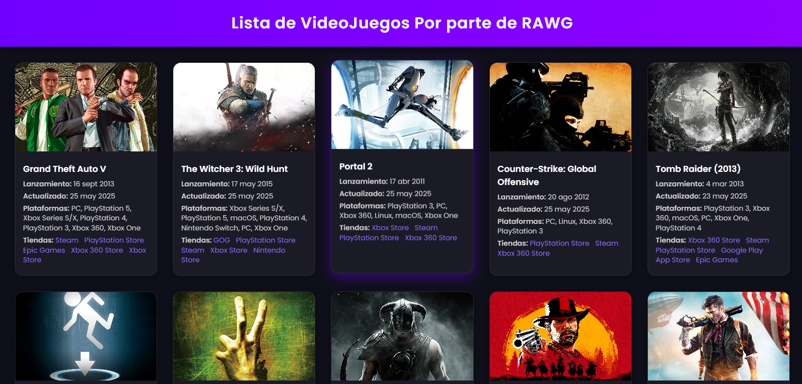

# 🎮 Explorador de Videojuegos con JavaScript y DOM

Proyecto desarrollado como parte de un taller práctico. Esta aplicación web consume la API pública de RAWG para mostrar información de videojuegos, con enfoque en renderizado dinámico y paginación utilizando **JavaScript puro** y manipulación del **DOM**.

---

## ✨ Características

- Consumo de API REST de [RAWG.io](https://rawg.io/apidocs)
- Renderizado dinámico de tarjetas de videojuegos
- Información detallada: imagen, nombre, fechas, plataformas y tiendas
- Paginación para navegar entre resultados
- Estilo visual moderno con tema oscuro por defecto
- Código modular y organizado con buenas prácticas

---

## 📸 Captura de pantalla



---

## 🛠️ Tecnologías utilizadas

- HTML5
- CSS3 (sin frameworks)
- JavaScript (ES6+)
- RAWG Video Games Database API

---

## 🚀 Cómo ejecutar el proyecto

1. Clona este repositorio:

```bash
git clone https://github.com/tu-usuario/explorador-videojuegos.git
